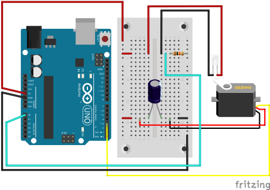
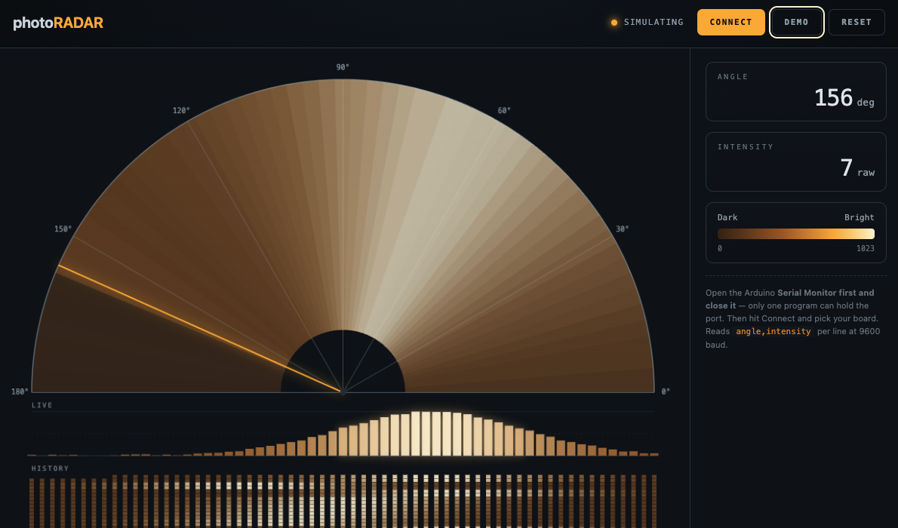

# photoRADAR 📡

A phototransistor "radar" built on an Arduino UNO: a servo sweeps a phototransistor back and forth across a 180° arc, measuring ambient light intensity at each angle. A companion web dashboard (using the Web Serial API) reads the live angle/intensity stream over USB and renders it as a radar-style sweep, a live bar chart, and a scrolling waterfall history.

## 🔦 How it works

The Arduino sketch sweeps a servo from 0° to 180° and back, pausing briefly at each step to take an analog reading from the phototransistor. Each reading is sent over serial as a simple `angle,intensity` line at 9600 baud. The web dashboard connects to the board over Web Serial, parses that stream, and visualizes it in real time — no server, no build step, just one HTML file.

## 🔧 Hardware

All components are from the Arduino Student Kit:

- Arduino UNO (R3)
- Phototransistor
- 10 KΩ resistor
- SM-S2309S servo motor
- 100 µF capacitor
- Breadboard + jumper wires
- USB cable

## 🔌 Wiring

- **Phototransistor**: Anode → 5V. Cathode → GND through the 10 KΩ resistor. A0 taps the junction between the cathode and the resistor (voltage-divider light sensor).
- **Servo (SM-S2309S)**: 5V and GND as normal, with the 100 µF capacitor bridging the two power leads (smooths current spikes from servo movement). Signal (yellow) wire → pin 3.
- Arduino UNO connects to the computer via USB, which supplies power and carries the serial data used by the web dashboard.

### Wiring diagram



The editable Fritzing project is available in [`fritzing/photoradar.fzz`](fritzing/photoradar.fzz).

## 📁 Repository structure

```
photoradar/
├── README.md
├── LICENSE
├── arduino/
│   └── photoradar/
│       └── photoradar.ino
├── fritzing/
│   ├── photoradar.fzz
│   └── photoradar_bb.svg
├── media/
│   ├── dashboard.png
│   └── demo.mp4
└── web/
    └── photoradar.html
```

## 🚀 Getting started

### 1. Flash the Arduino

1. Open `arduino/photoradar/photoradar.ino` in the Arduino IDE.
2. Select your board and port, then upload.
3. Confirm it's running by opening the Serial Monitor — you should see `angle,intensity` lines scrolling by.

> [!IMPORTANT]
> Close the Serial Monitor before moving on. Only one program can hold the serial port at a time, and the web dashboard needs it free to connect.

### 2. Open the dashboard

> [!NOTE]
> Requires a browser with Web Serial support — Chromium-based browsers (Chrome, Edge, Opera) have supported it for years, and Firefox 151+ (desktop) added support in 2026. Safari doesn't support it as of today.

1. Open `web/photoradar.html`.
2. Click **Connect** and select your Arduino's serial port.
3. Watch the sweep render live. Use **Demo** to preview the UI without hardware, and **Reset** to clear the display.

## 🎥 Demo



A short demonstration of the phototransistor sweeping through 180° while the
web dashboard visualizes the measured light intensity in real time.

[▶️ Watch the demo video](media/demo.mp4) (84.3 MB)

## 🔗 Credits

Based on the Arduino Student Kit, Lesson 9: [Light Wave Radar](https://studentkit.arduino.cc/studentkit/module/student-kit/lesson/light-wave-radar)

The circuit and base sensor concept follow that lesson; the sweep logic, serial protocol, and web dashboard in this repository are original.

## 📄 License

See [LICENSE](LICENSE).
